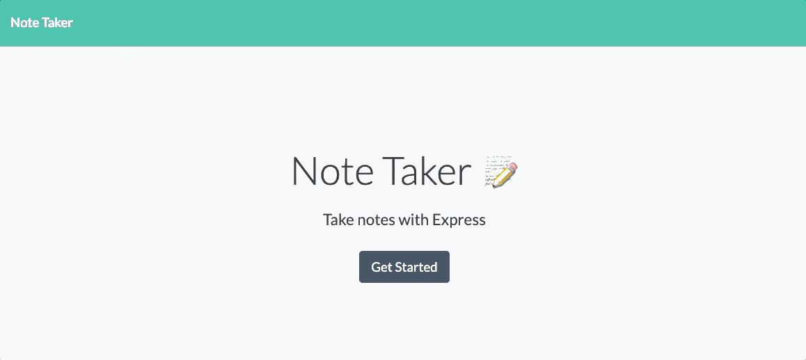

# Note Taker

This applications is for users to be able to write and save notes, as well as delete notes they've written before, to recognize their thoughts and keep track of tasks as they need to complete.

## Click [Here](https://kingsleyramos-note-taker.herokuapp.com/) for deployed application.
---

## Description 
---
Create an application that can be used to write, save, and delete notes. This application will use an Express backend and save and retrieve note data from a JSON file via routes. These routes and functions are tested using Jest.

## Tool & Resources
---
* [Bootstrap](https://getbootstrap.com/) - CSS framework used
* [JQuery](https://getbootstrap.com/) - JavaScript library used
* [Jest](https://jestjs.io/) - JavaScript testing framework used
* [Express](https://expressjs.com/) - Node Framework used
* [Heroku](https://www.heroku.com/) - Used to deploy application

## Assignment Challenges
---
### Relative Paths

I started placing files in the incorrect folder such as placing backend js and db files in the public folder. This caused some complex relative paths thus my application was not working properly.

I referred to a few classmates and advised me to move backend files outside of the public folder. I now understood the purpose of all each folder and folder names. I also understand the file layout and organization. This also made the relative paths easier to user.

### Heroku

At first, my application worked locally, but it did not properly work when hosted in Heroku. I noticed that my POST and DELETE methods were not properly posting and deleting. I then noticed that I did not read the homework prompt properly and realized my POST did not return the new note as said in the instructions. I thought I was returning the entire array. Once Corrected, DRY-ed up my code, it's all not working properly in Heroku. It took me a few hours to figure out why it wasn't working, but I then figured I didn't read the details.